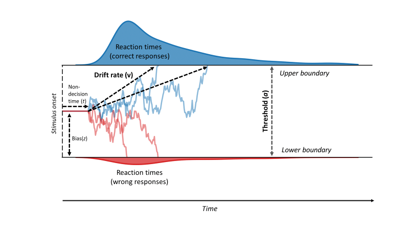

\newpage

```{r setup, include = FALSE}
library(tidyverse)
library(parallel)
library(papaja)
library(knitr)
library(glue)
library(brms)
library(BEST)
library(patchwork)
library(ggrepel)
library(papaja)
library(here)
library(plyr) # for ddply
library(lattice) # for histogram
library(tidyverse)
library(reshape2) # for dcast
library(car)
library(ggplot2)
library(glue)
library(qwraps2) # for summary_table
library(kableExtra)
library(tibble)
library(ggpubr)
library(flextable)
library(BayesFactor)
library(emmeans)
options(kableExtra.auto_format = FALSE)
Sys.setenv(LANG = "en")
inline_hook <- function (x) {
  
  if (is.numeric(x) ) {
    
    # if integer, print without decimal; otherwise print two places
    res <- ifelse(
      x == round(x),
      sprintf("%d", x),
      sprintf("%.3f", x)
      )
    
    paste(res, collapse = ", ")
    
  }
  
}
knit_hooks$set(inline = inline_hook)
knitr::opts_chunk$set(
  echo = TRUE, eval = TRUE, cache = TRUE,
  message = FALSE, warning = FALSE,
  fig.align = "center", dev = "pdf",
  out.width = "75%", fig.pos = "!htb"
  )
changeSciNot <- function(n) {
  
  output <- format(n, digits = 4, scientific = TRUE)
  output <- sub("e", " x 10^", output)
  output <- sub("\\+0?", "", output)
  output <- sub("-0?", "-", output)
  output
  
}
```

Parts 1, 2 and 3 of this document correspond to planned analyses (e.g., table of results, complementary analyses without outliers). Parts 4, 5 and 6 correspond to exploratory analyses with Drift Diffusion Models. All the procedure used for these analyses is detailed and can be used as a tutorial.

# Model comparison for the response time analysis

```{r data-import, include = FALSE}
#df1 <- read.csv ("data/df1.csv", header = TRUE, sep = ",")[-1]
DF <- read.csv ("data/DF.csv", header = TRUE, sep = ",") 
demo <-read.csv ("data/demo.csv", header = TRUE, sep= ";") 
```

```{r dataPrep, include = FALSE}
DF <- DF %>%  # 16320 obs
  filter (Gender !="FtM" ) %>% 
  # removing transgenders as we do exploratory analysis included sex as predictors 3 pp
  filter (Group =="TD" | Group == "ASD" & (AQ>31| ADOS_score_total >6 | ADI ==1))  
# removing participants who are neither above the cutoff on the AQ, nor on the ADOS or ADI => 3 pp (one of them - ID132 - was less than 50 % correct as well) # 14880
  
demo <- demo %>%  # 68 obs
  filter (Gender !="FtM" ) %>% 
  filter (Group =="TD" | Group == "ASD" & (AQ>31| ADOS_score_total >6 | ADI ==1)) # 62 obs
# Accuracy by subject and by condition
df_ACC_ID <-
  DF %>% 
  group_by(ID, Group, Sex, Age) %>% 
  dplyr::summarise (Accuracy = sum(ACC)/(n()))
df_ACC <-
  DF %>% 
  group_by(ID, Group, Prime, Congruency, Sex, Age, Emotion) %>% 
  dplyr::summarise (Accuracy = sum(ACC)/(n()))
#get poor performances 
outliers0 <- df_ACC_ID [df_ACC_ID$Accuracy <0.50,] # 1 obs, ID 114 
outliers1 <- df_ACC[df_ACC$Accuracy <0.50,] # 7 obs, ID 114 
# remove poor performances
DF1 <- DF [ ! DF$ID %in% outliers0$ID,] # 14640obs
df_ACC <- df_ACC [ ! df_ACC$ID %in% outliers0$ID,]
df_ACC_ID <- df_ACC_ID [ ! df_ACC_ID$ID %in% outliers0$ID,]
## Remove aberant data
DF1 <- DF1[!(DF1$RT < 300),] # 14420 obs => DF1 = DF total without outliers and aberrant data
# Keep only correct trials
df1 <- DF1[!(DF1$ACC == 0),]   # 14113 obs. => df = DF1 with only correct trials (and cleaned data)
# Outliers (in more than half of the condition => 4 conditions at least)
# On ACC
df_ACC_ASD<- df_ACC[df_ACC$Group=="ASD",]
outliersASD_ACC <- df_ACC_ASD [(df_ACC_ASD$Accuracy < quantile(df_ACC_ASD$Accuracy, 0.25) - 1.5 * IQR(df_ACC_ASD$Accuracy)| df_ACC_ASD$Accuracy > quantile(df_ACC_ASD$Accuracy, 0.75) + 1.5 * IQR(df_ACC_ASD$Accuracy)),]
# 112, 121, 124
df_ACC_TD<- df_ACC[df_ACC$Group=="TD",]
outliersTD_ACC <- df_ACC_TD [(df_ACC_TD$Accuracy < quantile(df_ACC_TD$Accuracy, 0.25) - 1.5 * IQR(df_ACC_TD$Accuracy)| df_ACC_TD$Accuracy > quantile(df_ACC_TD$Accuracy, 0.75) + 1.5 * IQR(df_ACC_TD$Accuracy)),]
# 218, 231
#On RT
df_RT <-
  df1 %>% 
  group_by(ID, GroupC, PrimeC,CongC, SexC, EmoC,Group, Prime, Congruency, Sex, Emotion) %>% 
  dplyr::summarise ("Mean RT" = mean(RT), "Sd RT" = sd(RT), "Median RT"= median (RT))
df_RT_ASD<- df_RT[df_RT$Group=="ASD",]
outliersASD_RT <- df_RT_ASD [(df_RT_ASD$"Mean RT" < quantile(df_RT_ASD$"Mean RT", 0.25) - 1.5 * IQR(df_RT_ASD$"Mean RT")| df_RT_ASD$"Mean RT" > quantile(df_RT_ASD$"Mean RT", 0.75) + 1.5 * IQR(df_RT_ASD$"Mean RT")),]
# 121
df_RT_TD<- df_RT[df_RT$Group=="TD",]
outliersTD_RT <- df_RT_TD [(df_RT_TD$"Mean RT" < quantile(df_RT_TD$"Mean RT", 0.25) - 1.5 * IQR(df_RT_TD$"Mean RT")| df_RT_TD$"Mean RT" > quantile(df_RT_TD$"Mean RT", 0.75) + 1.5 * IQR(df_RT_TD$"Mean RT")),]
# none
# demo data without excluded pp
demoTot <-
  demo%>% 
  mutate (ID = as.factor(ID),
          diagnostic_age = as.numeric (diagnostic_age)) %>% 
  filter (ID != "114") %>% 
  dplyr::rename (FSIQ = QIT)  # 61 obs
```


## Inclusion of different predictors
We first compared the three following models of increasing complexity and we kept the best one (i.e., the model with the lowest LOOIC - Leave-one-out cross validation information criterion - and the highest weight):  

- BMgcp : RT ~ 1 + GroupC * PrimeC * CongC + (1 + CongC * PrimeC || ID) + (1 +
GroupC * PrimeC * CongC || Target)  

- BMgcpe : RT ~ 1 + GroupC * PrimeC * CongC * EmoC + (1 + CongC * PrimeC *
EmoC || ID) + (1 + GroupC * PrimeC * CongC * EmoC || Target)  

- BMgcpes : RT ~ 1 + GroupC * PrimeC * CongC * EmoC * SexC + (1 + CongC * PrimeC * EmoC || ID) + (1 + GroupC * PrimeC * CongC * EmoC * SexC || Target)  

- BMgcpesP : RT ~ 1 + GroupC * CongC * PrimeC * EmoC + SexC + SexC:GroupC + (1 + CongC * PrimeC * EmoC || ID) + (1 + GroupC * CongC * PrimeC *EmoC + SexC + SexC:GroupC|| Target)  


  
```{r modelComp1RT, echo = FALSE}
# Model for main hypotheses
#get priors
# get_prior ( RT ~ 1 + GroupC * CongC * PrimeC + (1 + CongC * PrimeC||ID )+  (1 + CongC*PrimeC  ||Target),
#             data = df1, family = exgaussian() )
# # 
# # # set weak informative priors
# prior0 <- c(
#   prior(normal(0, 50), class = b),
#   prior(exponential(0.1), class = sd),
#   prior(exponential(0.1), class = sigma))
# 
# detectCores()
# #library (future)
# #plan(multisession(workers = 8))
# # run the model
# BMgcp <- brm (
#  RT ~ 1 + GroupC * PrimeC * CongC + (1 + CongC * PrimeC || ID) + (1 +
# GroupC * PrimeC * CongC || Target),
#   data = df1,
#   family = exgaussian(),
#   prior = prior0,
#   warmup = 2000, iter = 5000,
#   chains = 4,
#   cores = 4,
#   #future = TRUE,
#   sample_prior = TRUE
# )
# 
# #save(BMgcp, file = "models/BMgcp.rda")
# summary(BMgcp) # Rhat ok
# 
# BMgcpe <- brm (
# RT ~ 1 + GroupC * PrimeC * CongC * EmoC + (1 + CongC * PrimeC *
# EmoC || ID) + (1 + GroupC * PrimeC * CongC * EmoC || Target),
#   data = df1,
#   family = exgaussian(),
#   prior = prior0,
#   warmup = 2000, iter = 5000,
#   chains = 4,
#   cores = 4,
#   sample_prior = TRUE
# )
# 
# #save(BMgcpe, file = "models/BMgcpe.rda")
# summary (BMgcpe)  # Rhat ok
# 
# BMgcpes <- brm (
#  RT ~ 1 + GroupC * PrimeC * CongC * EmoC * SexC + (1 + CongC * PrimeC
# * EmoC || ID) + (1 + GroupC * PrimeC * CongC * EmoC * SexC || Target),
#   data = df1,
#   family = exgaussian(),
#   prior = prior0,
#   warmup = 2000, iter = 7000,
#   chains = 4,
#   cores = 4,
#   sample_prior = TRUE
# )
# 
# 
# save(BMgcpes, file = "models/BMgcpes.rda")
# summary(BMgcpes) # rhat ok
# 
# 
# BMgcpesP <- brm (
#   RT ~ 1 + GroupC * CongC * PrimeC * EmoC + SexC + SexC:GroupC + (1 + CongC * PrimeC *EmoC || ID) + (1 + GroupC * CongC * PrimeC *EmoC + SexC + SexC:GroupC|| Target),
#   data = df1,
#   family = exgaussian(),
#   prior = prior0,
#   warmup = 2000, iter = 7000,
#   chains = 4,
#   cores = 4,
#   sample_prior = TRUE
# )
# 
# 
# #save(BMgcpesP, file = "models/BMgcpesP.rda")
# summary (BMgcpesP) # Rhat ok
# 
# # Model comparison
# #MC_RT1 <- brms::loo(BMgcp, BMgcpe, BMgcpes, BMgcpesP, reloo=TRUE) 
# #show(MC_RT1)
# 
# BMgcp <- add_criterion(BMgcp, "waic")
# BMgcpe <- add_criterion(BMgcpe, "waic")
# BMgcpes <- add_criterion(BMgcpes, "waic")
# BMgcpesP <- add_criterion(BMgcpesP, "waic")
# 
# load("models/BMgcp.rda")
# load("models/BMgcpe.rda")
# load("models/BMgcpes.rda")
# load("models/BMgcpesP.rda")
# 
# BMgcp <- add_criterion(BMgcp, "loo")
# BMgcpe <- add_criterion(BMgcpe, "loo")
# BMgcpes <- add_criterion(BMgcpes, "loo")
# BMgcpesP <- add_criterion(BMgcpesP, "loo")
# 
# # displays the model comparison table
# # LOOCVfullRT1w <- loo_compare(
# #   BMgcp, BMgcpe, BMgcpes, BMgcpesP,
# #   criterion = "waic"
# # )
# 
# LOOCVfullRT1 <- loo_compare(
#   BMgcp, BMgcpe, BMgcpes, BMgcpesP,
#   criterion = "loo"
# )
# # saves the model comparison table
#saveRDS(LOOCVfullRT1, file = "models/ModCompFullRT1.rds")
# 
# # model weights
# MW_RT1<- model_weights(BMgcp, BMgcpe, BMgcpes, BMgcpesP, weights = "loo")
# # show(MW_RT1)
# save(MW_RT1, file ="Model/MW_1.rda")
load (file = "models/MW_1.rda")
MW_RT1bis <- as.data.frame(MW_RT1) %>% rownames_to_column(var = "model")
# loads the model comparison table
model_comparison_table_fullRT1 <- readRDS(file = "models/ModCompFullRT1.rds")
MCtableRT <- model_comparison_table_fullRT1 %>% data.frame %>% rownames_to_column(var = "model")
model_comparison_table_fullRT1 <- join (MCtableRT, MW_RT1bis) %>% dplyr::rename ("Model_Weights" = "MW_RT1")
# prints the table
apa_table(
  model_comparison_table_fullRT1 ,
  placement = "htb",
  align = rep("c", 9),
  digits = c(0, 3, 3, 3, 3, 3, 3, 3, 3, 3),
  caption = "Expected log pointise predictive density (ELPD) and LOOIC for each BLMM on RT.",
  # note = "For each model (for each line), the first two columns represent the estimated...",
  escape = TRUE,
  font_size = "tiny"
  )
## Code for seing trace plot - exemple with the final model
# load(file = "models/BMgcpe.rda")
# BMgcpe %>% 
#   plot(combo=c("hist", "trace"), widths = c(1, 1.5),
#        theme = theme_bw(base_size = 16))
```

As reported on *Table \@ref(tab:modelComp1RT)*, `BMgcpe` appeared to be the best model compared with models without emotion or with sex (full model or parsimonious model). Hence, we kept this model and then added covariates to this model.  

## Model with covariates

As preregistered, we added some covariates in the model and again, we kept the best one after model comparison. We included either PIQ or FSIQ and AQ as our two groups differed on these variables.

We compared the following models:  

- BMgcpe : RT ~ 1 + GroupC * PrimeC * CongC * EmoC + (1 + CongC * PrimeC *
EmoC || ID) + (1 + GroupC * PrimeC * CongC * EmoC || Target)  

- BMf : RT ~ 1 + GroupC * CongC * PrimeC * EmoC + FSIQc + (1 + CongC * PrimeC * EmoC || ID) + (1 + GroupC * CongC * PrimeC * EmoC || Target)  

- BMa : RT ~ 1 + GroupC * CongC * PrimeC * EmoC + AQc + (1 + CongC * PrimeC * EmoC || ID) + (1 + GroupC * CongC * PrimeC *EmoC || Target)  

- BMp : RT ~ 1 + GroupC * CongC * PrimeC * EmoC + PIQc +  (1 + CongC * PrimeC * EmoC || ID) + (1 + GroupC * CongC * PrimeC *EmoC || Target)  

- BMfa : RT ~ 1 + GroupC * CongC * PrimeC * EmoC + FSIQc + AQc + (1 + CongC * PrimeC * EmoC || ID) + (1 + GroupC * CongC * PrimeC *EmoC || Target)  

- BMpa : RT ~ 1 + GroupC * CongC * PrimeC * EmoC + PIQc + AQc + (1 + CongC * PrimeC * EmoC || ID) + (1 + GroupC * CongC * PrimeC *EmoC || Target)    


```{r modelComp2RT,echo = FALSE}
# BMfa<- brm (
#   RT ~ 1 + GroupC * CongC * PrimeC * EmoC 
#   + FSIQc + AQc
#   + (1 + CongC * PrimeC *EmoC || ID) 
#   + (1 + GroupC *CongC * PrimeC *EmoC || Target)
#   ,
#   data = df1,
#   family = exgaussian(),
#   prior = prior0,
#   warmup = 2000, iter = 5000,
#   chains = 4,
#   cores= 4,
#   sample_prior = TRUE
# )
 
# load("models/BMfa.rda")
# summary (BMfa)
# BMf<- brm (
#   RT ~ 1 + GroupC * CongC * PrimeC * EmoC 
#   + FSIQc 
#   + (1 + CongC * PrimeC * EmoC || ID) 
#   + (1 + GroupC * CongC * PrimeC * EmoC || Target)
#   ,
#   data = df1,
#   family = exgaussian(),
#   prior = prior0,
#   warmup = 2000, iter = 5000,
#   chains = 4,
#   cores= 4,
#   sample_prior = TRUE
# )
# BMa <- brm (
#   RT ~ 1 + GroupC * CongC * PrimeC * EmoC 
#   + AQc
#   + (1 + CongC * PrimeC *EmoC || ID) 
#   + (1 + GroupC *CongC * PrimeC *EmoC || Target)
#   ,
#   data = df1,
#   family = exgaussian(),
#   prior = prior0,
#   warmup = 2000, iter = 5000,
#   chains = 4,
#   cores= 4,
#   sample_prior = TRUE
# )
# BMpa<- brm (
#   RT ~ 1 + GroupC * CongC * PrimeC * EmoC 
#   + PIQc + AQc
#   + (1 + CongC * PrimeC *EmoC || ID) 
#   + (1 + GroupC *CongC * PrimeC *EmoC || Target)
#   ,
#   data = df1,
#   family = exgaussian(),
#   prior = prior0,
#   warmup = 2000, iter = 5000,
#   chains = 4,
#   cores= 4,
#   sample_prior = TRUE
# )
# BMp<- brm (
#   RT ~ 1 + GroupC * CongC * PrimeC * EmoC
#   + PIQc 
#   + (1 + CongC * PrimeC *EmoC || ID)
#   + (1 + GroupC *CongC * PrimeC *EmoC || Target)
#   ,
#   data = df1,
#   family = exgaussian(),
#   prior = prior0,
#   warmup = 2000, iter = 5000,
#   chains = 4,
#   cores= 4,
#   sample_prior = TRUE
# )
# 
# BMfa <- add_criterion(BMfa, "waic")
# BMf <- add_criterion(BMf, "waic")
# BMa <- add_criterion(BMa, "waic")
# BMpa <- add_criterion(BMpa, "waic")
# BMp <- add_criterion(BMp, "waic")
# BMgcpe <- add_criterion(BMgcpe, "waic")
# BMfa <- add_criterion(BMfa, "loo")
# BMf <- add_criterion(BMf, "loo")
# BMa <- add_criterion(BMa, "loo")
# BMpa <- add_criterion(BMpa, "loo") #  apareto_k > 0.7 => reloo
# BMp <- add_criterion(BMp, "loo")
# BMgcpe <- add_criterion(BMgcpe, "loo")
# looBMpa <- loo(BMpa)
# relooBMpa<- reloo(BMpa, loo= looBMpa)
# BMpa$criteria$loo <- relooBMpa
# 
#  save(BMfa, file = "models/BMfa.rda")
#  save(BMf, file = "models/BMf.rda")
#  save(BMa, file = "models/BMa.rda")
#  save(BMpa, file = "models/BMpa.rda")
#  save(BMp, file = "models/BMp.rda")
# save(BMgcpe, file = "models/BMgcpe.rda")
# 
# 
# 
# # displays the model comparison table
# LOOCVfullRT2w <- loo_compare(
#   BMfa, BMf, BMa, BMpa,BMp, BMgcpe,
#   criterion = "waic"
#  )
# p_waic greater than 0.4 => recommad using loo but ok because small
# LOOCVfullRT2 <- loo_compare(
#   BMfa, BMf, BMa, BMpa,BMp, BMgcpe,
#   criterion = "loo"
#  )
# 
# saveRDS(LOOCVfullRT2, file = "models/ModCompFullRT2.rds")
# # # 
# load("models/BMfa.rda")
# load("models/BMa.rda")
# load("models/BMpa.rda")
# load("models/BMp.rda")
# load("models/BMf.rda")
# load("models/BMgcpe.rda")
# MW_RT2w<- model_weights(BMfa, BMf, BMa, BMpa, BMp, BMgcpe,weights = "waic") 
#MW_RT2<- model_weights(BMfa, BMf, BMa, BMpa, BMp, BMgcpe,weights = "loo") 
# # # the two methods gives similar results. We kept waic for homogeneity
#save(MW_RT2, file ="models/MW_RT2.rda")
load("models/MW_RT2.rda")
MW_RT2bis <- as.data.frame(MW_RT2) %>% rownames_to_column(var = "model")
# loads the model comparison table
model_comparison_table_fullRT2 <- readRDS(file = "models/ModCompFullRT2.rds")
MCtableRT2 <- model_comparison_table_fullRT2 %>% data.frame %>% rownames_to_column(var = "model")
model_comparison_table_fullRT2 <- join (MCtableRT2, MW_RT2bis) %>% dplyr::rename ("Model_Weights" = "MW_RT2")
# prints the table
apa_table(
  model_comparison_table_fullRT2,
  placement = "htb",
  align = rep("c", 9),
  digits = c(0, 3, 3, 3, 3, 3, 3, 3, 3, 3),
  caption = "Expected log pointise predictive density (ELPD) and LOOIC for each of the four BLMMs on RT, with covariates",
  # note = "For each model (for each line), the first two columns represent the estimated...",
  escape = TRUE,
  font_size = "tiny"
)
```


The model without any covariates appeared to be the best model (see *Table \@ref(tab:modelComp2RT)*), despite the model with AQ and PIQ seems to be almost equally good. The outcome of these two models are very similar and we kept the more parsimonious (note that there is no evidence of an effect of AQ and PIQ on our data when looking at the output of the model with covariates).

## Posterior predictive check

One way of evaluating the model is to evaluate its predictions. If the model is a good description of the (true) process that generated the observed data, then it should be able to generate data that looks like the observed data. The process of generating data from the estimated posterior distribution is called *posterior predictive checking* and can be used in many different ways using the `pp_check()` method [@gabry_visualization_2019]. In *Figure \ref{fig:ppcheckBMgcpe}*, we depict the  distribution of the raw data (dark cuurve) along with the distribution of one hundred simulated datasets drawn from the posterior predictive distribution (light thin curves).Our model seems quite good at generating data that fit with our observed data. 


```{r ppcheckBMgcpe, echo = FALSE, out.width = "\\textwidth", fig.pos = "htb", fig.width = 5, fig.height = 2.7, fig.cap = "Posterior predictive checking for the BLMM."}
load("Model/BMgcpe.rda")

pp_check(BMgcpe, resp = "RT", nsamples = 1e2) +
  theme_minimal(base_size = 11) +
  theme(legend.position = "none") +
  xlab("Response Time (in ms)") +
  ylab("Density")

```


\newpage

## Results


```{r summaryBMgcpe, echo = FALSE }
load("models/BMgcpe.rda")
results_BMgcpe <- 
  summary(BMgcpe, prob = 0.95)$fixed %>%
  data.frame %>%
  rownames_to_column(var = "Term") %>%
  dplyr::select(-Bulk_ESS, -Tail_ESS) %>%
  magrittr::set_colnames(
    c("Term", "Estimate", "SE", "Lower", "Upper", "Rhat")
  ) %>%
  mutate_if(is.numeric, ~ round(., 3)) %>% 
  # compute BF for each effect
  mutate(
    BF01 = hypothesis(BMgcpe, glue("{Term} = 0") )$
      hypothesis$Evid.Ratio,# %>% round(., 3),
    Predictors = rep(
      c("Intercept",
        "Group", "Prime", "Congruency", "Emotion",
        "Group x Prime", "Group x Congruency",  "Prime x Congruency", "Group x Emotion", "Prime x Emotion", "Congruency x Emotion", 
        "Group x Prime x Congruency", "Group x Prime x Emotion", "Group x Congruency x Emotion", "Prime x Congruency x Emotion", 
        "Group x Prime x Congruency x Emotion"
      ),
      1)
  ) %>% 
  mutate(BF01 = ifelse(BF01 < 0.001, changeSciNot(BF01), round(BF01, 3) ) )
apa_table(
results_BMgcpe <-results_BMgcpe%>%
  dplyr::select(Predictors,Estimate, SE, Lower,Upper, Rhat, BF01),
placement = "!h",
align = c("c", "c"),
caption = "Estimates and BF01 from the BLMM on RT.",
 note = "For each predictor, the first two columns represent the estimated
    most probable value for the slope and its standard error (SE). The 'Lower' and 'Upper' are the bounds of the 95% CrI, whereas the 'Rhat' column reports the Gelman-Rubin statistic regarding the convergence. The last column reports the Bayes factor in favour of the null hypothesis (BF01).",
small = TRUE,
escape = TRUE
)
```


The results of this BLMM are summarized in *Table \@ref(tab:summaryBMgcpe)* and are described in the paper.


\newpage


# Analysis without outliers

We also ran our model removing participants who were outliers (results below Quartile 1 – 1.5 * Interquartile range or above Quartile 3 + 1.5 * Interquartile Range) on at least half of the condition for accuracy or for RT (3 ASD - 2 females, 1 male - and 3 TD - 2 females, 1 male, as preregistered on <https://osf.io/345jv>.

All relevant statistics regarding groups description are set out in *Table \@ref(tab:demoWO)*.

## Demographical data

```{r dataWO, include = FALSE}
# demo data without outliers
demoWO <-
  demoTot%>% 
  mutate (ID = as.factor(ID),
          diagnostic_age = as.numeric (diagnostic_age)) %>% 
  filter (ID != "112",ID!="121",ID!= "124",ID !="218",ID !="224",ID != "231")
#Age
bfAge <- as.data.frame (1/(ttestBF(formula = Age~Group,data=demoWO, var.equal=TRUE)))
BFage <- ifelse(bfAge[1,1] < 0.001, changeSciNot(bfAge[1,1]), round(bfAge[1,1], 3) ) 
# EDUCATION
bfEduc <- as.data.frame(1/(ttestBF(formula = Education~Group,data=demoWO, var.equal=TRUE)))
BFeduc <- ifelse(bfEduc[1,1] < 0.001, changeSciNot(bfEduc[1,1]), round(bfEduc[1,1], 3) ) 
# FSIQ
bfFSIQ <- as.data.frame( 1/(ttestBF(formula = FSIQ~Group,data=demoWO, var.equal=TRUE)))
BFfsiq <- ifelse(bfFSIQ[1,1] < 0.001, changeSciNot(bfFSIQ[1,1]), round(bfFSIQ[1,1], 3) ) 
# VIQ
bfVIQ <- as.data.frame (1/(ttestBF(formula = VIQ~Group,data=demoWO, var.equal=TRUE)))
BFviq <- ifelse(bfVIQ[1,1] < 0.001, changeSciNot(bfVIQ[1,1]), round(bfVIQ[1,1], 3) ) 
# PIQ
bfPIQ <- as.data.frame (1/(ttestBF(formula = PIQ~Group,data=demoWO, var.equal=TRUE)))
BFpiq <- ifelse(bfPIQ[1,1] < 0.001, changeSciNot(bfPIQ[1,1]), round(bfPIQ[1,1], 3) ) 
# AQ
bfAQ <- as.data.frame (1/(ttestBF(formula = AQ~Group,data=demoWO, var.equal=TRUE)))
BFaq <- ifelse(bfAQ[1,1] < 0.001, changeSciNot(bfAQ[1,1]), round(bfAQ[1,1], 3) ) 
# lecture test
bfLect <- as.data.frame (1/(ttestBF(formula = lect~Group,data=demoWO, var.equal=TRUE)))
BFlect <- ifelse(bfLect[1,1] < 0.001, changeSciNot(bfLect[1,1]), round(bfLect[1,1], 3) ) 
# stroop effect
bfStroop <- as.data.frame (1/(ttestBF(formula = interCor~Group,data=demoWO, var.equal=TRUE)))
BFstroop <- ifelse(bfStroop[1,1] < 0.001, changeSciNot(bfStroop[1,1]), round(bfStroop[1,1], 3) ) 
summary <-
  list ("Age" = 
          list ("Age" = ~qwraps2 :: mean_sd(.data$Age, denote_sd = "paren")),
        "Education"=
          list ("Education" = ~qwraps2 :: mean_sd (.data$Education, denote_sd = "paren")),
        "FSIQ" =
          list ("FSIQ" = ~qwraps2 :: mean_sd (.data$FSIQ, denote_sd = "paren")),
        "VIQ" =
          list ("VIQ" = ~qwraps2 :: mean_sd (.data$VIQ, denote_sd = "paren")),
        "PIQ"=
          list ("PIQ" = ~qwraps2 :: mean_sd (.data$PIQ, denote_sd = "paren")),
        "AQ"=
          list ("AQ"  = ~qwraps2 :: mean_sd (.data$AQ, denote_sd = "paren")),
        "Reading"=
          list ("Reading"  = ~qwraps2 :: mean_sd (.data$lect, denote_sd = "paren")),
        "Stroop Effect"=
          list ("Stroop Effect"  = ~qwraps2 :: mean_sd (.data$interCor, denote_sd = "paren"))
  )
table1 <-summary_table (dplyr:: group_by (demoWO, Group), summary)
table1 <- as.data.frame(table1)
BF01 <- c(BFage, BFeduc, BFfsiq, BFviq, BFpiq, BFaq, BFlect, BFstroop)
BF01 <- as.data.frame(BF01)
demoWO_stat <- cbind (table1, BF01)
```


```{r demoWO, echo =FALSE, result = "asis", out.width = "\\textwidth"}
apa_table(
    demoWO_stat,
    placement = "htb",
    align = c("c", "c"),
    caption = "Subject demographics – Means (M), standard deviations (SD) and BF01.",
    note = "*FSIQ = Full Scale Intelligence Quotient; VIQ = Verbal Intelligence Quotient; PIQ = Performance Intelligence Quotient ; AQ = Autism-Spectrum Quotient.",
    #small = FALSE,
    escape = TRUE
    )
```

## Posterior predictive check

```{r ppcheckBMwo, echo = FALSE, out.width = "\\textwidth", fig.pos = "!h", fig.width = 5, fig.height = 2.7, fig.cap = "Posterior predictive checking for the BLMM without outliers."}
load("models/BMwo.rda")
pp_check(BMwo, resp = "RT", nsamples = 1e2) +
  theme_minimal(base_size = 11) +
  theme(legend.position = "none") +
  xlab("Response Time (in ms)") +
  ylab("Density")
```

\newpage

## Results

```{r demodataWO, include = FALSE}
df1WO <- df1 %>% filter (ID != "112",
                         ID!="121",
                         ID!= "124",
                         ID !="218",
                         ID !="224",
                         ID != "231") # 12847 obs
```

```{r BMwo, include = FALSE, eval = FALSE}
BMwo<-  brm (
RT ~ 1 + GroupC * PrimeC * CongC * EmoC + (1 + CongC * PrimeC *
EmoC || ID) + (1 + GroupC * PrimeC * CongC * EmoC || Target),
  data = df1WO,
  family = exgaussian(),
  prior = prior0,
  warmup = 2000, iter = 5000,
  chains = 4,
  cores = 4,
  sample_prior = TRUE
)
save(BMwo, file="models/BMwo.rda")
```

```{r summaryBMwo, echo = FALSE, out.width = "\\textwidth" }
load("models/BMwo.rda")
#summary(BMwo)
# BMwo%>% 
#   plot(combo=c("hist", "trace"), widths = c(1, 1.5),
#        theme = theme_bw(base_size = 16))
results_BMwo <- 
  summary(BMwo, prob = 0.95)$fixed %>%
  data.frame %>%
  rownames_to_column(var = "Term") %>%
  dplyr::select(-Bulk_ESS, -Tail_ESS) %>%
  magrittr::set_colnames(
    c("Term", "Estimate", "SE", "Lower", "Upper", "Rhat")
  ) %>%
  mutate_if(is.numeric, ~ round(., 3)) %>% 
  # compute BF for each effect
  mutate(
    BF01 = hypothesis(BMwo, glue("{Term} = 0") )$
      hypothesis$Evid.Ratio,# %>% round(., 3),
    Predictors = rep(
      c("Intercept",
        "Group", "Prime", "Congruency", "Emotion",
        "Group x Prime", "Group x Congruency",  "Prime x Congruency", "Group x Emotion", "Prime x Emotion", "Congruency x Emotion", 
        "Group x Prime x Congruency", "Group x Prime x Emotion", "Group x Congruency x Emotion", "Prime x Congruency x Emotion", 
        "Group x Prime x Congruency x Emotion"
      ),
      1)
  )  %>% 
  mutate(BF01 = ifelse(BF01 < 0.001, changeSciNot(BF01), round(BF01, 3) ) )
apa_table(
results_BMwo <-results_BMwo %>%
  dplyr::select(Predictors,Estimate, SE, Lower,Upper, Rhat, BF01),
placement = "!h",
align = c("c", "c"),
caption = "Estimates from the ExGaussian BLMM on RT without outliers.",
small = TRUE,
escape = TRUE
)
```

\newpage

# Analysis on Inverse Efficiency Score (IES)

```{r dataIES, include = FALSE}
df_IES <- merge (df_ACC, df_RT) # 488
df_IES$IES <- df_IES$"Mean RT"/df_IES$Accuracy
df_IES <- df_IES %>% 
  select (ID, GroupC,PrimeC,CongC,EmoC, SexC, Prime, Congruency, Emotion, Accuracy, "Mean RT", "Median RT", "Sd RT", "IES")
df_IES <- merge (demo, df_IES, by= "ID")
# library("ggpubr")
# correlation studied
# ggscatter(df_IES[df_IES$Congruency == "CG" & df_IES$Prime =="HSF" & df_IES$Emotion == "joy",], x = "Mean RT", y = "Accuracy", 
#           color = "Group", palette = "jco",
#           add = "reg.line", conf.int = FALSE,
#           xlab = "RT", ylab = "Accuracy") +
#   stat_cor(aes(color = Group)) # ok ASD, TD non signif
# 
# ggscatter(df_IES[df_IES$Congruency == "CG" & df_IES$Prime =="HSF" & df_IES$Emotion == "anger",], x = "Mean RT", y = "Accuracy", 
#           color = "Group", palette = "jco",
#           add = "reg.line", conf.int = FALSE,
#           xlab = "RT", ylab = "Accuracy") +
#   stat_cor(aes(color = Group)) # ok ASD, TD non signif
# 
# ggscatter(df_IES[df_IES$Congruency == "CG" & df_IES$Prime =="LSF" & df_IES$Emotion == "joy",], x = "Mean RT", y = "Accuracy", 
#           color = "Group", palette = "jco",
#           add = "reg.line", conf.int = FALSE,
#           xlab = "RT", ylab = "Accuracy") +
#   stat_cor(aes(color = Group)) # ok ASD, TD non signif
# 
# ggscatter(df_IES[df_IES$Congruency == "CG" & df_IES$Prime =="LSF" & df_IES$Emotion == "anger",], x = "Mean RT", y = "Accuracy", 
#           color = "Group", palette = "jco",
#           add = "reg.line", conf.int = FALSE,
#           xlab = "RT", ylab = "Accuracy") +
#   stat_cor(aes(color = Group)) # ok ASD, TD non signif
# 
# ggscatter(df_IES[df_IES$Congruency == "ICG" & df_IES$Prime =="HSF" & df_IES$Emotion == "joy",], x = "Mean RT", y = "Accuracy", 
#           color = "Group", palette = "jco",
#           add = "reg.line", conf.int = FALSE,
#           xlab = "RT", ylab = "Accuracy") +
#   stat_cor(aes(color = Group)) # ok ASD, ok TD
# 
# ggscatter(df_IES[df_IES$Congruency == "ICG" & df_IES$Prime =="HSF" & df_IES$Emotion == "anger",], x = "Mean RT", y = "Accuracy", 
#           color = "Group", palette = "jco",
#           add = "reg.line", conf.int = FALSE,
#           xlab = "RT", ylab = "Accuracy") +
#   stat_cor(aes(color = Group)) # ok ASD, ok TD
# 
# ggscatter(df_IES[df_IES$Congruency == "ICG" & df_IES$Prime =="LSF" & df_IES$Emotion == "joy",], x = "Mean RT", y = "Accuracy", 
#           color = "Group", palette = "jco",
#           add = "reg.line", conf.int = FALSE,
#           xlab = "RT", ylab = "Accuracy") +
#   stat_cor(aes(color = Group)) # ok ASD, ok TD
# 
# ggscatter(df_IES[df_IES$Congruency == "ICG" & df_IES$Prime =="LSF" & df_IES$Emotion == "anger",], x = "Mean RT", y = "Accuracy", 
#           color = "Group", palette = "jco",
#           add = "reg.line", conf.int = FALSE,
#           xlab = "RT", ylab = "Accuracy") +
#   stat_cor(aes(color = Group)) # ok ASD, TD non signif
```


As preregistered, we also fitted models on the IES (= Response Time/Accuracy) to take into account the accuracy. 

## Inclusion of different predictors

We compared the 3 following models:  

- IBMgcp : IES ~ 1 + GroupC * CongC * PrimeC + (1 | ID)  

- IBMgcpe: IES ~ 1 + GroupC * CongC * PrimeC * EmoC+ (1 | ID)  

- IBMgcpes : IES ~ 1 + GroupC * CongC * PrimeC * EmoC * SexC + (1 | ID)  

- IBMgcpesP: IES ~ 1 + GroupC * CongC * PrimeC * EmoC + SexC + SexC : EmoC + (1 | ID) 

```{r modelCompIES1,echo = FALSE}
# priorI1 <- c(
#   prior(normal(0, 50), class = b),
#   prior(exponential(0.1), class = sd),
#   prior(exponential(0.1), class = sigma))
# 
# IBMgcp <- brm (
#   IES ~ 1 + GroupC*CongC*PrimeC
#   + (1 | ID),
#   data = df_IES,
#   family = exgaussian(),
#   prior = priorI1,
#   warmup = 2000, iter = 10000,
#   chains = 4,
#   cores = 4,
#   sample_prior = TRUE,
#   control=list(adapt_delta=0.99),
#   save_all_pars = TRUE
# )  # 1 divergent transition +>  increasing adapt_delta to 0.99 => ok
# summary(IBMgcp)
# # 
# IBMgcpe <- brm (
#   IES ~ 1 + GroupC*CongC*PrimeC*EmoC
#   + (1 | ID),
#   data = df_IES,
#   family = exgaussian(),
#   prior = priorI1,
#   warmup = 2000, iter = 10000,
#   chains = 4,
#   cores = 4,
#   sample_prior = TRUE,
#   control=list(adapt_delta=0.95)
# ) # ok
# summary(IBMgcpe)
# 
# IBMgcpes <- brm (
#   IES ~ 1 + GroupC*CongC*PrimeC*EmoC*SexC
#   + (1 | ID),
#   data = df_IES,
#   family = exgaussian(),
#   prior = priorI1,
#   warmup = 2000, iter = 10000,
#   chains = 4,
#   cores = 4,
#   sample_prior = TRUE,
#   control=list(adapt_delta=0.99, max_treedepth = 15)
# ) # 2 divergent transition which can't be removed with increasing adapt_delta => simplified the model https://mc-stan.org/misc/warnings.html#divergent-transitions-after-warmup  
# summary(IBMgcpes) # Rhat ok
# IBMgcpes %>% # trace plot ok
#   plot(combo=c("hist", "trace"), widths = c(1, 1.5),
#        theme = theme_bw(base_size = 16))
#=> we can keep it
# 
# summary(IBMgcpes) 
# 
# IBMgcpesP <- brm (
#   IES ~ 1 + GroupC*CongC*PrimeC*EmoC+ SexC + GroupC:SexC
#   + (1 | ID),
#   data = df_IES,
#   family = exgaussian(),
#   prior = priorI1,
#   warmup = 2000, iter = 10000,
#   chains = 4,
#   cores = 4,
#   sample_prior = TRUE,
#   control=list(adapt_delta=0.95)
# ) # ok
# 
# summary(IBMgpcesP) # ok
# 
# 
# IBMgcp <- add_criterion(IBMgcp, "waic")
# IBMgcpe <- add_criterion(IBMgcpe, "waic")
# IBMgcpes <- add_criterion(IBMgcpes, "waic")
# IBMgcpesP <- add_criterion(IBMgcpesP, "waic")
# # # !! warning!! p_waic estimates greater than 0.4. We recommend trying loo instead. and other for each model
# 
# 
#with loo => problematic observation => reloo
# looIBMgcp <- loo(IBMgcp)
# relooIBMgcp <- reloo(IBMgcp, loo= looIBMgcp)
# IBMgcp$criteria$loo <- relooIBMgcp
# 
# looIBMgcpe <- loo(IBMgcpe)
# relooIBMgcpe <- reloo(IBMgcpe, loo= looIBMgcpe)
# IBMgcpe$criteria$loo <- relooIBMgcpe
# 
# looIBMgcpes <- loo(IBMgcpes)
# relooIBMgcpes <- reloo(IBMgcpes, loo= looIBMgcpes)
# IBMgcpes$criteria$loo <- relooIBMgcpes
# 
# looIBMgcpesP <- loo(IBMgcpesP)
# relooIBMgcpesP <- reloo(IBMgcpesP, loo= looIBMgcpesP)
# IBMgcpesP$criteria$loo <- relooIBMgcpesP
# # 
# save(IBMgcp, file = "models/IBMgcp.rda")
# save(IBMgcpe, file = "models/IBMgcpe.rda")
# save(IBMgcpes, file = "models/IBMgcpes.rda")
# save(IBMgcpesP, file = "models/IBMgcpesP.rda")
# load("models/IBMgcp.rda")
# load("models/IBMgcpe.rda")
# load("models/IBMgcpes.rda")
# load("models/IBMgcpesP.rda")
# 
# # displays the model comparison table
# LOOCVfullIES1 <- loo_compare(
#   IBMgcp, IBMgcpe,IBMgcpesP, IBMgcpes,
#   criterion = "waic"
# ) # not reliable
# 
# LOOCVfullIES1loo <- loo_compare(
#   IBMgcp, IBMgcpe, IBMgcpesP, IBMgcpes,
#   criterion = "loo"
#  )
# # saves the model comparison table
#saveRDS(LOOCVfullIES1loo, file = "models/ModCompFullIES1loo.rds")
# 
# # Model weights
#MWIES1 <-model_weights(IBMgcp, IBMgcpe, IBMgcpesP, IBMgcpes, weights = "loo")
#save(MWIES1, file = "models/MWIES1.rda")
load("models/MWIES1.rda")
MWIES1bis <- as.data.frame(MWIES1) %>% rownames_to_column(var = "model")
# loads the model comparison table
model_comparison_table_fullIES1 <- readRDS(file = "models/ModCompFullIES1loo.rds")
MCtableIES1 <- model_comparison_table_fullIES1 %>% data.frame %>% rownames_to_column(var = "model")
model_comparison_table_fullIES1 <- join (MCtableIES1, MWIES1bis) %>% dplyr::rename ("Model_Weights" = "MWIES1")
# prints the table
apa_table(
  model_comparison_table_fullIES1,
  placement = "htb",
  align = rep("c", 9),
  digits = c(0, 3, 3, 3, 3, 3, 3, 3, 3, 3),
  caption = "Expected log pointise predictive density (ELPD) and LOOIC for each of the three BLMM on IES.",
  # note = "For each model (for each line), the first two columns represent the estimated...",
  escape = TRUE,
  font_size = "tiny"
  )
```

The model `IBMgcpe` seemed to be the best one (see *Table \@ref(tab:modelCompIES1)*).

## Inclusion of covariates

We then included covariates in the best model. We compared the following models:  
- IBMfa : IES ~ 1 + GroupC * CongC * PrimeC * EmoC +  FSIQ + AQ + (1 | ID)  

- IBMf : IES ~ 1 + GroupC * CongC * PrimeC * EmoC +   FSIQ +(1 | ID)  

- IBMa : IES ~ 1 + GroupC * CongC * PrimeC * EmoC +  AQ +(1 | ID)  

- IBMpa : IES ~ 1 + GroupC * CongC * PrimeC * EmoC +   PIQ + AQ + (1 | ID)  

- IBMp : IES ~ 1 + GroupC * CongC * PrimeC * EmoC +   PIQ + (1 | ID)


```{r modelCompIES2,echo = FALSE}
# IBMfa <- brm (
#   IES ~ 1 + GroupC *  CongC * PrimeC * EmoC
#   + FSIQc + AQc
#   + (1 | ID),
#   data = df_IES,
#   family = exgaussian(),
#   prior = priorI1,
#   warmup = 2000, iter = 10000,
#   chains = 4,
#   cores = 4,
#   sample_prior = TRUE,
#   control=list(adapt_delta=0.95)
# ) # ok
# summary(IBMfa) # Rhat ok
# 
# IBMf <- brm (
#   IES ~ 1 + GroupC * CongC * PrimeC * EmoC
#   + FSIQc
#   + (1 | ID),
#   data = df_IES,
#   family = exgaussian(),
#   prior = priorI1,
#   warmup = 2000, iter = 10000,
#   chains = 4,
#   cores = 4,
#   sample_prior = TRUE,
#   control=list(adapt_delta=0.95)
# ) # ok
# summary(IBMf) # Rhat ok
# 
# IBMa <- brm (
#   IES ~ 1 + GroupC * CongC * PrimeC * EmoC
#   + AQc
#   + (1 | ID),
#   data = df_IES,
#   family = exgaussian(),
#   prior = priorI1,
#   warmup = 2000, iter = 10000,
#   chains = 4,
#   cores = 4,
#   sample_prior = TRUE,
#   control=list(adapt_delta=0.95)
# ) # ok
# summary(IBMa) # Rhat ok
# 
# IBMpa <- brm (
#   IES ~ 1 + GroupC * CongC * PrimeC * EmoC
#   + PIQc + AQc
#   + (1 | ID),
#   data = df_IES,
#   family = exgaussian(),
#   prior = priorI1,
#   warmup = 2000, iter = 10000,
#   chains = 4,
#   cores = 4,
#   sample_prior = TRUE,
#   control=list(adapt_delta=0.99, max_treedepth = 15) #ok
# )
# summary(IBMpa)
# 
# IBMp <- brm (
#   IES ~ 1 + GroupC * CongC * PrimeC * EmoC
#   + PIQc
#   + (1 | ID),
#   data = df_IES,
#   family = exgaussian(),
#   prior = priorI1,
#   warmup = 2000, iter = 10000,
#   chains = 4,
#   cores = 4,
#   sample_prior = TRUE,
#   control=list(adapt_delta=0.99, max_treedepth = 15) #ok
# ) #  divergent transition => increase adapt_delta
# summary(IBMp) # Rhat ok
# 
# 
# IBMfa <- add_criterion(IBMfa, "waic")
# IBMf <- add_criterion(IBMf, "waic")
# IBMa <- add_criterion(IBMa, "waic")
# IBMpa <- add_criterion(IBMpa, "waic")
# IBMp <- add_criterion(IBMp, "waic")
# # WARNING:  p_waic estimates greater than 0.4. We recommend trying loo instead.
# 
# 
# looIBMfa <- loo(IBMfa) #with loo => problematic observation => reloo
# relooIBMfa <- reloo(IBMfa, loo= looIBMfa)
# IBMfa$criteria$loo <- relooIBMfa
# 
# looIBMf <- loo(IBMf)
# relooIBMf <- reloo(IBMf, loo= looIBMf)
# IBMf$criteria$loo <- relooIBMf
# 
# looIBMa <- loo(IBMa)
# relooIBMa <- reloo(IBMa, loo= looIBMa)
# IBMa$criteria$loo <- relooIBMa
# 
# looIBMpa <- loo(IBMpa)
# relooIBMpa <- reloo(IBMpa, loo= looIBMpa)
# IBMpa$criteria$loo <- relooIBMpa
# 
# looIBMp <- loo(IBMp)
# relooIBMp <- reloo(IBMp, loo= looIBMp)
# IBMp$criteria$loo <- relooIBMp
# 
# save(IBMfa, file = "models/IBMfa.rda")
# save(IBMf, file = "models/IBMf.rda")
# save(IBMa, file = "models/IBMa.rda")
# save(IBMpa, file = "models/IBMpa.rda")
# save(IBMp, file = "models/IBMp.rda")
# 
# 
# 
# #displays the model comparison table
# LOOCVfullIES2 <- loo_compare(
#   IBMfa, IBMf, IBMa,IBMpa, IBMp, IBMgcpe,
#   criterion = "loo"
# )
# 
# # saves the model comparison table
# saveRDS(LOOCVfullIES2, file = "models/ModCompFullIES2.rds")
# 
# MWIES2 <- model_weights(IBMfa, IBMf, IBMa, IBMpa, IBMp, IBMgcpe, weights ="loo")
# save(MWIES2, file ="models/MWIES2.rda")
# loads the model comparison table
model_comparison_table_fullIES2 <- readRDS(file = "models/ModCompFullIES2.rds")
load("models/MWIES2.rda")
MWIES2bis <- as.data.frame(MWIES2) %>% rownames_to_column(var = "model")
# loads the model comparison table
model_comparison_table_fullIES2 <- readRDS(file = "models/ModCompFullIES2.rds")
MCtableIES2 <- model_comparison_table_fullIES2 %>% data.frame %>% rownames_to_column(var = "model")
model_comparison_table_fullIES2 <- join (MCtableIES2, MWIES2bis) %>% dplyr::rename ("Model_Weights" = "MWIES2")
# prints the table
apa_table(
  model_comparison_table_fullIES2,
  placement = "htb",
  align = rep("c", 9),
  digits = c(0, 3, 3, 3, 3, 3, 3, 3, 3, 3),
  caption = "Expected log pointise predictive density (ELPD) and LOOIC for each of the four BLMM on IES, with covariates.",
  # note = "For each model (for each line), the first two columns represent the estimated...",
  escape = TRUE,
  font_size = "tiny"
  )
```

The model `IBMf`, with FSIQ as a covariate, appear to be the best model (see *Table \@ref(tab:modelCompIES2)*). We checked the validity of this model with posterior predictive check (cf. *Figure 2*), which appeared to be good. 
 
## Posterior predictive check
 
```{r ppcheckIBMf, echo = FALSE,  out.width = "\\textwidth", fig.pos = "!h", fig.width = 5, fig.height = 2.7, fig.cap = "Posterior predictive checking for BLMM concerning the IES."}
load("models/IBMf.rda")
pp_check(IBMf, resp = "IES", nsamples = 1e2) +
  theme_minimal(base_size = 11) +
  theme(legend.position = "none") +
  xlab("IES") +
  ylab("Density")
```

\newpage

## Results

```{r summaryIBMf, echo = FALSE}
results_IBMf <- 
  summary(IBMf, prob = 0.95)$fixed %>%
  data.frame %>%
  rownames_to_column(var = "Term") %>%
  dplyr::select(-Bulk_ESS, -Tail_ESS) %>%
  magrittr::set_colnames(
    c("Term", "Estimate", "SE", "Lower", "Upper", "Rhat")
  ) %>%
  mutate_if(is.numeric, ~ round(., 3)) %>% 
  # compute BF for each effect
  mutate(
    BF01 = hypothesis(IBMf, glue("{Term} = 0") )$
      hypothesis$Evid.Ratio,# %>% round(., 3),
    Predictors = rep(
       c("Intercept",
        "Group", "Congruency", "Prime", "Emotion", "FSIQ",
        "Group x Congruency", "Group x Prime",  "Prime x Congruency", "Group x Emotion", "Congruency x Emotion", "Prime x Emotion", 
        "Group x Prime x Congruency", "Group x Congruency x Emotion", "Group x Prime x Emotion",  "Prime x Congruency x Emotion",     
        "Group x Prime x Congruency x Emotion"
      ),
      1)
  )  %>% 
  mutate(BF01 = ifelse(BF01 < 0.001, changeSciNot(BF01), round(BF01, 3) ) )
apa_table(
results_IBMf <-results_IBMf %>%
  dplyr::select(Predictors,Estimate, SE, Lower,Upper, Rhat, BF01),
placement = "htb",
align = c("c", "c"),
caption = "Estimates from the ExGaussian BLMM concerning the IES.",
small = TRUE,
escape = TRUE
)
postIBMf <- posterior_samples(IBMf)
postG <- mean (postIBMf$"b_GroupC" > 0)
IBMPGE_emm <- emmeans(IBMf, ~ PrimeC:GroupC:EmoC) 
IBMPGE_fac <- update(IBMPGE_emm, levels =list(PrimeC= c("LSF","HSF"), GroupC=c("TD","ASD"),EmoC = c("Happy", "Angry")))
contIES1 <- as.data.frame(contrast(IBMPGE_fac, method = "pairwise", by = "GroupC"))
```

\newpage

# Visual data exploration

```{r data, echo = FALSE, cache = FALSE, fig.cap = "Distribution of RTs per Group, Congruency, and Prime."}
# imports data and removes the first column
df <- read.csv("data/df.csv")[-1] %>%
  # removing RTs equal to zero
  filter(RT > 299) %>%
  # converts RTs from ms to seconds
  mutate(RT = RT / 1000) %>%
  # removing transgenders as we do exploratory analysis included sex as predictor
  filter(Gender != "FtM" ) %>%
  # removing participants who are neither above the cutoff for autism on the AQ, nor on the ADOS or ADI
  filter(Group =="TD" | Group == "ASD" & (AQ > 31 | ADOS_score_total > 6 | ADI == 1) ) %>%
  # removing participant who is less than 50 % correct
  filter(ID != "114")
df %>%
  ggplot(aes(x = RT, color = Group, fill = Group) ) +
  geom_density(position = "identity", alpha = 0.5) +
  # facetting by congruency and prime
  facet_wrap(~ Congruency * Prime) +
  theme_bw(base_size = 12) +
  labs(x = "Response time (in seconds)", y = "Density") +
  # forces lower xlim to 0
  xlim(0, NA)
```

Figure \ref{fig:data} shows that the distributions of response times (RTs) are roughly similar across conditions, with slightly slower and more spread RTs in the ASD group as compared to the TD group. In Figure \ref{fig:correctness1}, we plot the distribution of RTs for correct versus incorrect responses according to the characteristics of the participants (Sex and Group). In Figure \ref{fig:correctness2}, we make a similar plot, now faceting by condition (i.e., congruency and prime type).

```{r correctness1, echo = FALSE, fig.pos = "!h", fig.cap = "Distribution of RTs for correct and incorrect responses according to Sex and Group. Incorrect responses are in pink and correct responses in blue."}
df %>%
  ggplot(aes(x = RT, color = as.factor(ACC), fill = as.factor(ACC) ) ) +
  geom_density(position = "identity", alpha = 0.5) +
  facet_wrap(~ Sex * Group) +
  theme_bw(base_size = 12) +
  labs(x = "Response time (in seconds)", y = "Density") +
  scale_color_discrete(name = "Accuracy", labels = c("Incorrect", "Correct") ) +
  scale_fill_discrete(name = "Accuracy", labels = c("Incorrect", "Correct") ) +
  xlim(0, NA)
```

```{r correctness2, echo = FALSE, fig.cap = "Distribution of RTs for correct and incorrect responses according to Congruency and Prime. Incorrect responses are in pink and correct responses in blue."}
df %>%
  ggplot(aes(x = RT, color = as.factor(ACC), fill = as.factor(ACC) ) ) +
  geom_density(position = "identity", alpha = 0.5) +
  facet_wrap(~ Congruency * Prime, nrow = 2) +
  theme_bw(base_size = 12) +
  labs(x = "Response time (in seconds)", y = "Density") +
  scale_color_discrete(name = "Accuracy", labels = c("Incorrect", "Correct") ) +
  scale_fill_discrete(name = "Accuracy", labels = c("Incorrect", "Correct") ) +
  xlim(0, NA)
```

\newpage

# Diffusion decision modelling

Diffusion decision models (DDM) allow detailed explanations of behaviour in two-alternative forced choice tasks. We know that the data collected in such tasks obey some law-like patterns. For instance, RT distributions are generally positively skewed, with the skewness increasing with task difficulty. We also know that the mean of the RTs is proportional to the standard deviation of the RTs. Increases in the difficulty usually lead to increased RTs and decreased accuracy. Moreover, changes in difficulty also produces regular changes in the distribution of RTs, most notably in its spread but not much in its shape [for a review, see @forstmann_sequential_2016]. Therefore, several models have been proposed to account for the peculiarities of the data coming from such tasks as well as to relate it to the underlying cognitive processes.

## What is a diffusion decision model?

The vanilla (i.e., original) diffusion decision model (the "Wiener model") is a continuous-time evidence accumulation model for binary choice tasks [@ratcliff_theory_1978]. It assumes that in each trial evidence is accumulated in a noisy (diffusion) process by a single accumulator. As shown in Figure \ref{fig:wiener-figure}, evidence accumulation starts at some point (the starting point or "bias") and continues until the accumulator hits one of the two decision bounds in which case the corresponding response is given. The total response time is the sum of the decision time from the accumulation process plus non-decisional components [@vandekerckhove_crossed_2010;@wabersich_rwiener_2014;@wagenmakers_methodological_2009-1].^[Where diffusion is to be understood as the continuous equivalent of a random-walk.] In other words, this kind of model provides a *decomposition* of RT data that isolates components (of processing) from stimulus encoding to decision so that they can be studied individually [@ratcliff_diffusion_2008;@wagenmakers_ez-diffusion_2007].

(ref:crossref) @vinding_volition_2018

```{r wiener-figure, echo = FALSE, out.width = "75%", fig.cap = "A graphical illustration of the Wiener diffusion model. Figure from (ref:crossref)."}

```

In sum, the original Wiener model allows decomposing responses to a binary choice tasks and corresponding response times into four latent processes [@singmann_diffusion/wiener_2017]:

- The **drift rate** $\delta$ (delta) is the average slope of the accumulation process towards the boundaries (i.e., it represents the average amount of evidence accumulated per unit time). The larger the (absolute value of the) drift rate, the stronger the evidence for the corresponding response option (thus quantifying the "ease of processing").

- The **boundary separation** $\alpha$ (alpha) is the distance between the two decision bounds and can be interpreted as a measure of response caution, with high $\alpha$ meaning high caution.

- The **starting point** (or bias) $\beta$ (beta) of the accumulation process is a measure of response bias towards one of the two response boundaries (it is sometimes fixed to $0.5$ in case of correct vs. incorrect boundaries, but it need not to be).

- The **non-decision time** $\tau$ (tau) captures all non-decisional processes such as stimulus encoding and (motor) response processes.

An important decision that has to be made before setting up a model is which parameters are allowed to differ between which conditions. One common constraint of the Wiener model is that the parameters that are set before the evidence accumulation process starts (i.e., boundary separation, starting point, and non-decision time) cannot change based on stimulus characteristics that are not known to the participant before the start of the trial. However, as the response time was recorded from the presentation of the *target*, the participant already had knowledge about the prime when the evidence accumulations began. Thus, the characteristics of the item (i.e., in our case, congruency and spatial characteristics) are only allowed to affect the drift rate, but we compared this model to an augmented model including the nature of the prime (i.e., LSF vs. HSF) and an interaction with Group on the response bias (starting point). Also note that all stimulus-related variables are manipulated within-subject. Thus, the maximal random-effects structure [@barr_random_2013-1] entails corresponding random-effects parameters for each fixed-effect. To set up the model we need to invoke the `brms::brmsformula()` function and construct one formula for each of the four parameters of the Wiener model.

## Fitting the model

<!--
We begin this section by briefly giving a slightly more technical definition of our model. If $\delta$ is a real, $\alpha$ and $\tau$ are positive reals and $\beta \in [0, 1]$, the probability density function of the Wiener distribution is (for correct responses):
$$
\mathrm{Wiener}(y \ | \ \alpha, \tau, \beta, \delta) = \frac{\alpha^{3}}{(y - \tau)^{3 / 2}} \exp \left(-\delta \alpha \beta - \frac{\delta^{2}(y - \tau)}{2}\right) \sum_{k = -\infty}^{\infty}(2 k + \beta) \phi\left(\frac{2 k \alpha + \beta}{\sqrt{y - \tau}}\right)
$$
where $\phi(x)$ denotes the standard normal density function [@feller_introduction_1968;@navarro_fast_2009]. Then, our model can be written (in a simplified form, omitting the varying effects) as:
$$
\begin{aligned}
RT_{i} &\sim \mathrm{Wiener}(\delta_{i}, \alpha_{i}, \tau_{i}, \beta_{i}) && \mbox{Observation Wiener model for the RTs.} \\
\delta_{i} &= \beta_{0} + \beta_{1} \cdot \text{Group}_{i} + \beta_{2} \cdot \text{Congr}_{i} + \ && \mbox{Linear model for the drift rate.} \\
& \ \ \ \ \ \beta_{3} \cdot \text{Prime}_{i} + \dotsc + \beta_{n} \cdot \text{Xn}_{i} && \mbox{Plus all interaction terms (Xn).} \\
\log(\alpha_{i}) &= \beta_{0} + \beta_{1} \cdot \text{Group}_{i} && \mbox{Linear model for the (log) boundary separation.} \\
\log(\tau_{i}) &= \beta_{0} + \beta_{1} \cdot \text{Group}_{i} && \mbox{Linear model for the (log) non-decision time.}  \\
\mathrm{logit}(\beta_{i}) &= \beta_{0} + \beta_{1} \cdot \text{Group}_{i} && \mbox{Linear model for the (logit) bias.} \\
\beta_{0[\delta]} &\sim \mathrm{Normal}(0, 5) && \mbox {Prior on the intercept for the drift rate.} \\
\beta_{n[\delta]} &\sim \mathrm{Normal}(0, 1) && \mbox {Prior on the slopes for the drift rate.} \\
\beta_{0[\alpha]}, \beta_{0[\tau]}, \beta_{0[\beta]} &\sim \mathrm{Normal}(0, 1) && \mbox {Prior on the intercept for the other parameters.} \\
\beta_{1[\alpha]}, \beta_{1[\tau]}, \beta_{1[\beta]} &\sim \mathrm{Normal}(0, 1) && \mbox {Prior on the slopes for the other parameters.} \\
\end{aligned}
$$
where $i$ denotes observations (i.e., lines in the dataframe). 
-->

We fitted all models using the `brms` package [@R-brms_a].

```{r model1-formula, eval = TRUE, results = "hide", cache = FALSE}
# defining the model formula (one "linear model" per parameter)
formula <- brmsformula(
  # drift rate (delta)
  RT | dec(ACC) ~ 1 + GroupC * CongC * PrimeC + (1 | ID) + (1 | Target),
  # boundary separation parameter (alpha)
  bs ~ 1 + GroupC + (1 | ID) + (1 | Target),
  # non-decision time (tau)
  ndt ~ 1 + GroupC + (1 | ID) + (1 | Target),
  # starting point or bias (beta)
  bias ~ 1 + GroupC * PrimeC + (1 | ID) + (1 | Target)
  )
# defining the priors
priors <- c(
  # priors for the intercepts
  prior("normal(0, 5)", class = "Intercept"),
  prior("normal(0, 1)", class = "Intercept", dpar = "bs"),
  prior("normal(0, 1)", class = "Intercept", dpar = "ndt"),
  prior("normal(0, 1)", class = "Intercept", dpar = "bias"),
  # priors for the slopes
  prior("normal(0, 1)", class = "b"),
  # priors on the SD of the varying effects
  prior("exponential(1)", class = "sd")
  )
```

```{r draft, echo = FALSE, eval = FALSE}
# which priors should be defined?
# get_prior(formula = formula, data = df, family = wiener() )
# retrieves the Stan code generated by brms
# make_stancode(
#   formula = formula,
#   data = df,
#    family = wiener(
#     link = "identity", link_bs = "log",
#     link_ndt = "log", link_bias = "logit"
#     ),
#   prior = priors
#   )
# 
# visualising the priors on the untransformed scale for bs and ndt
# plot(density(exp(rnorm(1e4, 0, 1) ) ) )
# visualising the priors on the untransformed scale for bias
# plot(density(plogis(rnorm(1e4, 0, 1) ) ) )
# help with initial values for DDMs
# from https://github.com/paul-buerkner/Bayesian-IRT-paper/blob/master/Bayesian-IRT.R
# https://discourse.mc-stan.org/t/function-to-specify-initial-values-in-brms-model-has-dimension-mismatch/8692
```

We then fit this model below using the `brms::brm()` function. We run eight chains, each for 5000 iterations and using the first 2000 iterations used as warmup (i.e., the first 2000 samples of each chain are discarded from the final analysis). This results in a total of $8 \times (5000 - 2000) = 24000$ samples from the (joint) posterior distribution that will be used for inference.

```{r model1, eval = FALSE, results = "hide", cache = FALSE}
# specify initial values to help the model start sampling
# (with small variation between chains)
chains <- 8 # number of chains
epsilon <- 0.1 # variability in starting value for the NDT intercept
get_init_value <- function(x) list(Intercept_ndt = rnorm(n = 1, mean = x, sd = epsilon) )
inits_drift <- replicate(chains, get_init_value(-3), simplify = FALSE)
# fitting the model
varying_effects_prime <- brm(
  formula, 
  data = df,
  # specifying the family and link functions for each parameter
  family = wiener(
    link = "identity", link_bs = "log",
    link_ndt = "log", link_bias = "logit"
    ),
  # comment this line to use default priors
  prior = priors,
  # list of initialisation values
  inits = inits_drift,
  init_r = 0.05,
  warmup = 2000, iter = 5000,
  chains = chains, cores = chains,
  control = list(adapt_delta = 0.99, max_treedepth = 15),
  # saves the model (as .rds) or loads it if it already exists
  file = "models/wiener_varying_effects_prime.rds",
  # needed for hypothesis testing
  sample_prior = TRUE
  )
```

<!--
We can generate predictions from this model using the `predict()` method. 
```{r preds-model1, echo = FALSE, eval = FALSE, results = "hide"}
bayesplot::color_scheme_set("brewer-Dark2")
bayesplot::color_scheme_set("brewer-Accent")
varying_effects %>%
  plot(
    pars = "^sd_", # c("^b_", "^sd_"),
    N = 4,
    combo = c("dens_overlay", "trace"),
    theme = theme_bw(base_size = 10), # +  legend_none(),
    ask = FALSE
    )
    
# generating predictions
preds_wiener <- predict(
  full_varying, summary = FALSE, 
  negative_rt = TRUE, nsamples = 1e2
  )
# saving predictions
save(
  preds_wiener,
  file = "models/brms_wiener_predictions_varying_effects.rds",
  compress = "xz"
  )
# loading it
# load("models/brms_wiener_constant_effects_predictions.rds")
# appends the predictions to the original dataframe
df <- bind_cols(df, data.frame(t(preds_wiener) ) )
````
-->

# DDM: Interpretation of the results

## Model comparison

We first compared the previous model with a similar model including an effect of the prime on the response bias parameter. As response time was recorded from the presentation of the target, it is possible that the prime influenced the response bias toward accurate (or erroneous) responses. Table \ref{tab:model_comparison} reports the expected log-pointwise predictive density (ELPD, a measure of the model's fit), the number of effective parameters (p_WAIC, a measure of the model's complexity) and the WAIC, as well as the difference of these criteria between the two models.

```{r model_comparison, echo = FALSE, eval = TRUE, results = "asis"}
# # importing the varying-effects model
# varying_effects <- readRDS("models/wiener_varying_effects.rds")
# # importing the varying-effects model + effect of prime on response bias
varying_effects_prime <- readRDS("models/wiener_varying_effects_prime.rds")
# # performing model comparison via approximate LOO-CV
# varying_effects <- add_criterion(varying_effects, "waic")
# varying_effects_prime <- add_criterion(varying_effects_prime, "waic")
# #displays the model comparison table
# LOOCV <- loo_compare(varying_effects, varying_effects_prime, criterion = "waic")
# #computes pseudo-BMA weights
# weights <- loo_model_weights(varying_effects, varying_effects_prime)
#MW_ddm<- model_weights(varying_effects, varying_effects_prime, weights = "waic")
# #saves the model comparison table
#saveRDS(LOOCV, file = "models/model_comparison.rds")
# saveRDS(weights, file = "models/weights.rds")
# loads the model comparison table
model_comparison_table <- readRDS(file = "models/model_comparison.rds")
weights <- readRDS(file = "models/weights.rds")
# MW_ddm <- as.data.frame(weights) %>% rownames_to_column(var="model")
# prints the table
apa_table(
  model_comparison_table %>%
    data.frame %>%
    rownames_to_column(var = "model") %>%
    mutate(Model_Weights = rev(as.numeric(weights) ) ),
  placement = "htb",
  align = rep("c", 10),
  digits = c(0, 3, 3, 3, 3, 3, 3, 3, 3, 3),
  caption = "Expected log-pointwise predictive density (ELPD) and WAIC for the two DDMs.",
  # note = "For each model (for each line), the first two columns represent the estimated...",
  escape = TRUE,
  font_size = "tiny"
  )
```

From this table (especially from the last two columns) we see that the varying-effects model including an effect of Prime on the response bias has the lowest WAIC, which can be interpreted by saying that this model is estimated to be the closest to the "true model" in an information-theoretic sense, or equivalently, that it is expected to have the lowest out-of-sample deviance. In the following, we therefore report estimates from this model.

## Interpreting the output

Now that we have fitted the model, we are left with the task of interpreting the output from the best model. As can be seen from the model summary displayed below, the output of the model is a (joint) posterior distribution over all parameters of the model. We can marginalise this joint distribution to obtain the (marginal) posterior distribution on each parameter, which is given by the `summary()` method.

```{r summary-model1, echo = TRUE, eval = TRUE}
# prints a summary of the model
summary(varying_effects_prime)
```

We can retrieve the samples from the joint posterior distribution using the `brms::posterior_samples()` method.

```{r posterior-samples, echo = TRUE, eval = TRUE}
# retrieves posterior samples (for all parameters)
varying_effects_prime <- readRDS(file = "models/wiener_varying_effects_prime.rds")
post <- posterior_samples(varying_effects_prime)
# the "post" object has 24.000 rows (number of posterior samples) and
# 396 columns (number of parameters)
dim(post)
# displaying the first six samples for the first 5 parameters
head(post[, 1:5])
```

Which outputs a matrix with parameters of the model in columns and posterior samples in rows. Let's examine these results for each parameter in more details.

### Drift rate

From there, we can study the marginal posterior distribution for each parameter of interest. For instance, Figure \ref{fig:posterior-intercept-drift} represents the posterior distribution of the intercept for the drift rate (i.e., the overall mean value of the drift rate).

```{r posterior-intercept-drift, echo = TRUE, eval = TRUE, fig.cap = "Posterior distribution of the intercept for the drift rate. The mode (i.e., the most probable value) and the 95\\% credible interval are also displayed."}
# retrieves the posterior samples for the average drift rate
average_drift <- post$b_Intercept
# plotting it
plotPost(
  average_drift, showMode = TRUE,
  xlab = expression(paste(beta[0][paste("[", delta, "]")] ) )
  )
```

Figure \ref{fig:posterior-intercept-drift} reveals (consistently with the summary displayed previously) that the most probable value for the intercept of the drift rate (given our model, the priors, and the data) is `r round(fixef(varying_effects_prime)[1, 1], 3)`, and that there is a 95% probability that the population value for this parameter lies in the interval ranging from `r round(fixef(varying_effects_prime)[1, 3], 3)` to `r round(fixef(varying_effects_prime)[1, 4], 3)`. More interestingly, we can inspect the posterior distribution of the slopes for the effects of `Group`, `Prime`, and `Cong`.

```{r posterior-slopes-drift, echo = FALSE, eval = TRUE, out.width = "100%", fig.asp = 0.5, fig.cap = "Posterior distribution of the slopes for the drift rate, for Group, Prime, and Cong (respectively). The mode (i.e., the most probable value) and the 95\\% credible interval are also displayed."}
# retrieves the posterior samples for the average drift rate
posterior_slopes_drift <- post[, 5:7]
# plotting it
par(mfrow = c(1, 3) )
plotPost(
  posterior_slopes_drift[, 1], showMode = TRUE, compVal = 0,
  xlab = expression(paste(beta[delta], "Group") )
  )
plotPost(
  posterior_slopes_drift[, 2], showMode = TRUE,# compVal = 0,
  xlab = expression(paste(beta[delta], "Cong") )
  )
plotPost(
  posterior_slopes_drift[, 3], showMode = TRUE, compVal = 0,
  xlab = expression(paste(beta[delta], "Prime") )
  )
```

Figure \ref{fig:posterior-slopes-drift} reveals that `Cong` increased the drift rate whereas `Prime` decreased it (recall that the drift rate can be interpreted as the "ease of processing"),^[As `Cong` and `Prime` were coded using sum contrasts (-0.5 vs. 0.5), these effects can be interpreted as follows: going from incongruent to congruent stimuli or to HSF to LSF stimuli is associated with "more" ease of processing.] whereas the effect of `Group` is estimated to be quasi null (cf. later hypothesis testing). What about interactions?

```{r posterior-interactions-drift, echo = FALSE, eval = TRUE, out.width = "75%", fig.asp = 1, fig.cap = "Posterior distribution of the interactions slopes for the drift rate. The mode (i.e., the most probable value) and the 95\\% credible interval are also displayed."}
# retrieves the posterior samples for the average drift rate
posterior_interactions_drift <- post[, 8:11]
# plotting it
par(mfrow = c(2, 2) )
plotPost(
  posterior_interactions_drift[, 1], showMode = TRUE, compVal = 0,
  xlab = expression(paste(beta[delta], "Group:Cong") )
  )
plotPost(
  posterior_interactions_drift[, 2], showMode = TRUE, compVal = 0,
  xlab = expression(paste(beta[delta], "Group:Prime") )
  )
plotPost(
  posterior_interactions_drift[, 3], showMode = TRUE, compVal = 0,
  xlab = expression(paste(beta[delta], "Cong:Prime") )
  )
plotPost(
  posterior_interactions_drift[, 4], showMode = TRUE, compVal = 0,
  xlab = expression(paste(beta[delta], "Group:Cong:Prime") )
  )
```

Figure \ref{fig:posterior-interactions-drift} reveals that the interaction between `Group` and `Prime` and the double interaction between `Group`, `Cong`, and `Prime` were most probably close to zero. However, the interaction between `Group` and `Cong` seems reliably negative, which can be interpreted as follows: going from TD to ASD is associated with a decrease in the effect of `Cong` (which was positive) on the drift rate. In other words, whereas the main effect of `Cong` indicates that congruent stimuli are easier to process than incongruent stimuli, this interaction indicates that this effect is less pronounced in the ASD group than in the TD group. The interaction between `Cong` and `Prime` can be interpreted similarly, where going from incongruent to congruent stimuli increase the effect of `Prime` (which was positive) on the drift rate (and reciprocally).

<!--
\newpage
-->

### Boundary separation

Recall that the boundary separation parameter can be interpreted as a measure of response caution (with high $\alpha$ corresponding to high response caution), and that the linear model for this parameter is on the log scale (i.e., we used a log link function): $\log(\alpha_{i}) = \beta_{0} + \beta_{1} \cdot \text{Group}_{i}$.

```{r posterior-bs, echo = FALSE, eval = TRUE, out.width = "75%", fig.asp = 1, fig.cap = "Posterior distribution of the intercept and the slope for Group for the boundary separation. The upper two distributions are the distributions of the intercept and the slope (on the linear scale). The lower two plots are the posterior distributions of the boundary separation parameter in the TD and ASD groups, respectively (on the linear scale)."}
# retrieves the posterior samples for the boundary-separation
posterior_intercept_bs <- post$b_bs_Intercept
posterior_slope_bs <- post$b_bs_GroupC
# computes the posterior distribution of the BS for the TD group
posterior_bs_td <- exp(posterior_intercept_bs - 0.5 * posterior_slope_bs)
# computes the posterior distribution of the BS for the ASD group
posterior_bs_asd <- exp(posterior_intercept_bs + 0.5 * posterior_slope_bs)
# plotting it
par(mfrow = c(2, 2) )
plotPost(
  exp(posterior_intercept_bs), showMode = TRUE, # compVal = 0,
  xlab = expression(paste(exp(beta[0][paste("[", alpha, "]")] ) ) )
  )
plotPost(
  exp(posterior_slope_bs), showMode = TRUE, # compVal = 0,
  xlab = expression(paste(exp(beta["group"][paste("[", alpha, "]")] ) ) )
  )
plotPost(
  posterior_bs_td, showMode = TRUE, # compVal = 0,
  xlab = expression(paste(alpha["TD"]) ) #[paste("[", tau, "]")] ) )
  )
plotPost(
  posterior_bs_asd, showMode = TRUE, # compVal = 0,
  xlab = expression(paste(alpha["ASD"]) ) #[paste("[", tau, "]")] ) )
  )
```

Therefore, we have to apply the inverse link function (i.e., $\exp(\cdot)$) to the parameter to be able to interpret it. Taking $\exp(\beta_{1})$ gives the proportional change in the value of the boundary-separation parameter when we go from the TD group to the ASD group (see upper right panel of Figure \ref{fig:posterior-bs}). In our case, $\exp(\beta_{1}) \approx$ `r round(exp(fixef(varying_effects_prime)[12, 1]), 3)`, which means that going from TD to ASD leads to an increase of approximately 8 % in the value of the boundary-separation parameter. In other words, response caution seems higher in the ASD group (see lower right panel of Figure \ref{fig:posterior-bs}) than in the TD group (see lower left panel of Figure \ref{fig:posterior-bs}).

<!--
round(fixef(varying_effects_prime)[1, 3], 3)
\newpage
-->

### Starting point

The starting point is a measure of response bias towards one of the two response boundaries (here, correct vs. incorrect) and is bounded between 0 and 1. The linear model for this parameter is on the logit (log-odds) scale: $\log(\frac{\beta_{i}}{1 - \beta_{i}}) = \beta_{0} + \beta_{1} \cdot \text{Group}_{i}$. Therefore, we have to apply the inverse link function (i.e., $\mathrm{logit}^{-1}(\beta_{i}) = \mathrm{logistic}(\beta_{i}) = \frac{1}{1 + \exp(- \beta_{i})} = \frac{\exp(\beta_{i})}{\exp(\beta_{i}) + 1}$) to the parameter to be able to interpret it on its natural scale (i.e., between 0 and 1).

```{r posterior-bias, echo = FALSE, eval = TRUE, out.width = "75%", fig.asp = 1, fig.cap = "Posterior distribution of the intercept and the slope for Group for the sarting point (bias). The upper two distributions are the distributions of the intercept (on the natural scale of the parameter) and the exponential of the slope (giving an odds ratio). The lower two plots are the posterior distributions of the estimated statting points in the TD and ASD groups, respectively (on the linear scale)."}
# retrieves the posterior samples for the starting point parameter
posterior_intercept_bias <- post$b_bias_Intercept
posterior_slope_bias <- post$b_bias_GroupC
posterior_slope_bias_prime <- post$b_bias_PrimeC
posterior_slope_bias_interaction <- post$`b_bias_GroupC:PrimeC`
# computes the posterior distribution of the bias for the TD group
posterior_bias_td <- plogis(posterior_intercept_bias - 0.5 * posterior_slope_bias)
# computes the posterior distribution of the bias for the ASD group
posterior_bias_asd <- plogis(posterior_intercept_bias + 0.5 * posterior_slope_bias)
# plotting it
par(mfrow = c(2, 2) )
plotPost(
  plogis(posterior_intercept_bias), showMode = TRUE, # compVal = 0,
  xlab = expression(logistic(paste(beta[0][paste("[", beta, "]")] ) ) )
  )
plotPost( # odds ratio between ASD and TD
  exp(posterior_slope_bias), showMode = TRUE, compVal = 1,
  xlab = expression(exp(paste(beta["group"][paste("[", beta, "]")] ) ) )
  )
plotPost(
  posterior_bias_td, showMode = TRUE, # compVal = 0,
  xlab = expression(paste(beta["TD"]) )
  )
plotPost(
  posterior_bias_asd, showMode = TRUE, # compVal = 0,
  xlab = expression(paste(beta["ASD"]) )
  )
```

Taking the exponential of the slope gives an odds ratio of approximately 0.99, which indicates that the odds of producing a correct answer (vs. an incorrect one) are approximately the same in both groups. This can also be read from the posterior distribution of the bias parameter in the ASD group, when compared with the posterior distribution of the bias parameter in the TD group. We can also plot the posterior distribution of the difference between ASD and TD (cf. Figure \ref{fig:posterior-bias-difference}).

```{r posterior-bias-difference, echo = FALSE, eval = TRUE, fig.asp = 1, out.width = "50%", fig.cap = "Posterior distribution of the difference between the estimated starting point in the ASD group and the estimated starting point in the TD group."}
# computes the posterior distribution of the group difference in the bias parameter
posterior_bias_group_difference <- posterior_bias_asd - posterior_bias_td
# plotting it
par(mfrow = c(1, 1) )
plotPost(
  posterior_bias_group_difference, showMode = TRUE, compVal = 0,
  xlab = expression(paste(beta["ASD"]) - paste(beta["TD"]) )
  )
```

As shown in Figure \ref{fig:posterior-bias-prime}, the effect of `Prime` was positive, which means that HSF (vs. LSF) primes were associated with a "bias" towards accurate responses. No interaction effect was found between `Group` and `Prime`.

```{r posterior-bias-prime, echo = FALSE, eval = TRUE, fig.asp = 1, out.width = "50%", fig.cap = "Posterior distribution of the odds ratio between LSF and HSF primes on the starting point."}
# plotting it
par(mfrow = c(1, 1) )
plotPost(
  exp(posterior_slope_bias_prime), showMode = TRUE,
  xlab = expression(exp(paste(beta["prime"][paste("[", beta, "]")] ) ) )
  )
```

\newpage

### Non-decision time

Recall that the non-decision time parameter can be interpreted as a measure of the time used by non-decisional processes such as stimulus encoding or motor response, and that the linear model for this parameter is on the log scale (i.e., we used a log link function): $\log(\tau_{i}) = \beta_{0} + \beta_{1} \cdot \text{Group}_{i}$.

```{r posterior-ndt, echo = FALSE, eval = TRUE, out.width = "75%", fig.asp = 1, fig.cap = "Posterior distribution of the intercept and the slope for Group for the non-decision time. The upper two distributions are the distributions of the intercept and the slope (on the linear scale). The lower two plots are the posterior distributions of the non-decision time in the TD and ASD groups, respectively (on the linear scale)."}
# retrieves the posterior samples for the boundary-separation
posterior_intercept_ndt <- post$b_ndt_Intercept
posterior_slope_ndt <- post$b_ndt_GroupC
# computes the posterior distribution of the NDT for the TD group
posterior_ndt_td <- exp(posterior_intercept_ndt - 0.5 * posterior_slope_ndt)
# computes the posterior distribution of the NDT for the ASD group
posterior_ndt_asd <- exp(posterior_intercept_ndt + 0.5 * posterior_slope_ndt)
# plotting it
par(mfrow = c(2, 2) )
plotPost(
  exp(posterior_intercept_ndt), showMode = TRUE, # compVal = 0,
  xlab = expression(exp(paste(beta[0][paste("[", tau, "]")] ) ) )
  )
plotPost(
  exp(posterior_slope_ndt), showMode = TRUE, # compVal = 0,
  xlab = expression(exp(paste(beta["group"][paste("[", tau, "]")] ) ) )
  )
plotPost(
  posterior_ndt_td, showMode = TRUE, # compVal = 0,
  xlab = expression(paste(tau["TD"]) )
  )
plotPost(
  posterior_ndt_asd, showMode = TRUE, # compVal = 0,
  xlab = expression(paste(tau["ASD"]) )
  )
```

Therefore, we have to apply the inverse link function (i.e., $\exp(\cdot)$) to the parameter to be able to interpret it. Taking $\exp(\beta_{1})$ gives the proportional change in the value of the non-decision time parameter when we go from the TD group to the ASD group. In our case, $\exp(\beta_{1}) \approx 1.24$ which means that going from TD to ASD leads to an increase of approximately 24 % of the non-decision time parameter value. In other words, non-decisional processes seem to take longer in the ASD group than in the TD group.

\newpage

## Evaluating the model


In Figure \ref{fig:ppc}, we depict the  distribution of the raw data along with the distribution of ten simulated datasets.

```{r ppc, echo = TRUE, eval = TRUE, out.width = "75%", fig.cap = "Posterior predictive checking. The dark blue line represents the distribution of raw data whereas light blue lines represent data simulated from the posterior distribution."}
pp_check(varying_effects_prime, nsamples = 10) +
  theme_bw(base_size = 12) +
  labs(x = "Response time (in seconds)", y = "Density")
```

As can be seen from Figure \ref{fig:ppc}, the model seems pretty good at simulating data that looks like the observed data. From this predictive/sampling distribution (i.e., the distribution of simulated data sets), so-called "Bayesian *p*-values" can be computed to quantify the compatibility between the observed data and the proposed model.

\newpage

## Hypothesis testing

We can test any arbitrary hypothesis using the `brms::hypothesis()` method, which is computing a Bayes factor via the Savage-Dickey method [@wagenmakers_bayesian_2010], which consists in comparing the posterior probability density to the prior probability density for some hypothesised value for the parameter of interest (e.g., $\theta = 0$).

```{r hypothesis1, echo = TRUE, eval = TRUE, fig.cap = "Hypothesis testing via the Savage-Dickey method. The resulting Bayes factor (BF) is the ratio of the height (i.e., the density probability) of the posterior versus prior distribution at some value of interest for the parameter (here it is 0)."}
# Plotting the Savage-Dickey Bayes factor
# testing whether the interaction Group * Congruency is equal to 0
hyp <- hypothesis(varying_effects_prime, "GroupC:CongC = 0")
# prints the output
print(hyp)
# plotting it
data.frame(posterior = hyp$samples$H1, prior = hyp$prior_samples$H1) %>%
  gather(type, value) %>%
  ggplot(aes(x = value, fill = type) ) +
  geom_vline(xintercept = 0, linetype = 3, alpha = 1) +
  geom_area(stat = "density", alpha = 0.8, position = "identity") +
  theme_bw(base_size = 12) +
  labs(x = expression(beta[group:congruency]), y = "Probability density") +
  scale_fill_brewer(palette = "Dark2", direction = -1) +
  theme(legend.title = element_blank() ) +
  coord_cartesian(xlim = c(-2, 2) )
```

The resulting Bayes factor (called "Evid. Ratio" in the output) may be interpreted as follows: the observed data is 4.09 more likely under the hypothesis of null effect than under the hypothesis of a non-null effect. Alternatively, the BF can be interpreted as an *updating factor*, indicating by "how much" we should update our *prior odds* (the ratio of the a priori probability of $H_{0}$ versus $H_{1}$) to convert them into *posterior odds* (the ratio of the a posteriori probability of $H_{0}$ versus $H_{1}$). Note however that the BF is highly dependent on the prior put on the parameter. In this example, we see that despite the fact that the posterior distribution is "less centered" on 0 than the prior distribution, because of the vagueness of the prior distribution, the posterior distribution still allocates more probability density to 0 than the prior distribution does.

```{r summary, eval = TRUE, echo = FALSE, cache = FALSE, results = "asis"}
# formatting BFs in table
changeSciNot <- function(n) {
  
  n <- ifelse(n < 0, abs(n), n)
  output <- format(n, digits = 4, scientific = TRUE)
  output <- sub("e", "*10^", output)
  output <- sub("\\+0?", "", output)
  output <- sub("-0?", "-", output)
  output
  
}
# prints a summary of the model (all non-intercept parameters)
results_varying_effects_prime <-
  summary(varying_effects_prime, prob = 0.95)$fixed %>%
  data.frame %>%
  rownames_to_column(var = "Parameter") %>%
  filter(str_detect(Parameter, "Intercept", negate = TRUE) ) %>%
  dplyr::select(-Bulk_ESS, -Tail_ESS) %>%
  magrittr::set_colnames(c("Term", "Estimate", "SE", "Lower", "Upper", "Rhat") ) %>%
  # replace dots by two-dots
  # mutate(Term = str_replace(Term, "\\.", ":") ) %>%
  # compute BF for each effect
  mutate(
      BF01 = hypothesis(varying_effects_prime, glue("{Term} = 0") )$
          hypothesis$Evid.Ratio # %>% round(., 3)
      ) %>%
  # round BFs
  mutate(BF01 = ifelse(BF01 < 0.001, changeSciNot(BF01), round(BF01, 3) ) ) %>%
  # if numeric, round to 3 decimals
  mutate_if(is.numeric, round, 3)
########################
# Outputting the table #
########################
apa_table(
    results_varying_effects_prime,
    placement = "htb",
    align = rep("c", 7),
    digits = c(0, 3, 3, 3, 3, 3, 3),
    caption = "Estimates and BFs for the slopes from the hierarchical DDM.",
    note = "For each slope (for each line), the first two columns represent the estimated
    most probable value and its standard error (SE). The 'Lower' and 'Upper' columns
    contain the lower and upper bounds of the 95% CrI, whereas the 'Rhat' column reports
    the Gelman-Rubin statistic. The last column reports the Bayes factor in favour of the
    null hypothesis (BF01).",
    escape = TRUE
    )
```

Finally, Table \ref{tab:summary} reports the estimates and associated credible intervals and $\text{BF01}$s for all slopes in the hierarchical DDM. To sum up our results, these estimates suggest that `Cong` increasew the drift rate, while `Prime` seems to decrease it, which means that congruent (vs. incongruent) and LSF (vs. HSF) stimuli increase the ease of processing of the stimulus. The positive effect of `Group` on the non-decision time parameter suggests non-decision related processes (such as the stimulus processing or motor processes) are different according to the group (i.e., they take longer in the ASD group than in the TD group). Finally, the effect of `Prime` on the starting point suggests that HSF (vs. LSF) primes were associated with an a priori "bias" towards accurate responses.

# Acknowledgments

Most of the computations presented in this paper were performed using the GRICAD infrastructure (https://gricad.univ-grenoble-alpes.fr), which is partly supported by the Equip@Meso project (reference ANR-10-EQPX-29-01) of the programme Investissements d'Avenir supervised by the Agence Nationale pour la Recherche.

\newpage

# Session information

```{r create_r-references, echo = FALSE, cache = FALSE}
papaja::r_refs(file = "bib/r-references.bib")
```

```{r, echo = TRUE, cache = FALSE}
sessionInfo()
```

\newpage

# References